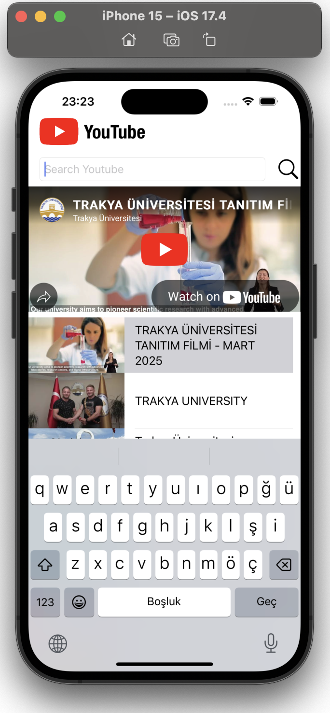
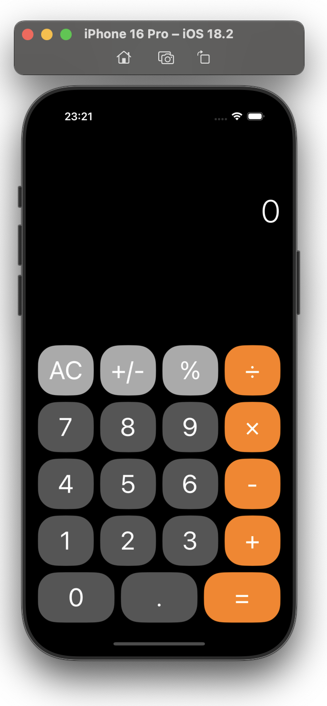
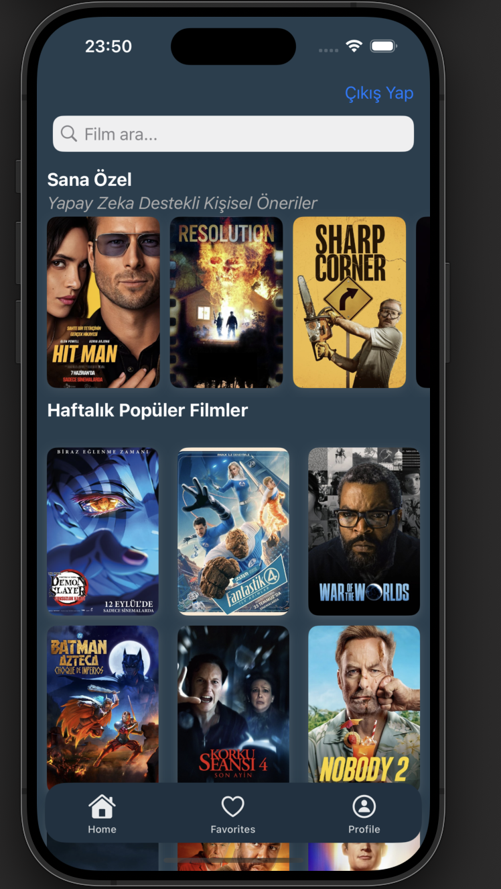

<h1 align="center">Hi, I'm Özge Kurnaz</h1>

<i>Mobile Developer | iOS Developer</i>

I’m a Junior Mobile Developer passionate about building intuitive and user-friendly apps with Swift, UIKit, and Flutter.
I focus on crafting clean interfaces and seamless user experiences, while exploring how AI can enhance mobile functionality.
Always eager to learn and grow, I love turning ideas into real-world projects and continuously improving my skills across both native and cross-platform development.

<h2 align="center">Some of My Projects</h2>

  
  
  

---

### 🚀 Kullandığım Teknolojiler

  
  
  
  
  
  
  

---

### 📊 GitHub İstatistiklerim

  
  

---

### 🔥 GitHub Contribution Streak

  

---

### 🏆 GitHub Trophy

  

---

### ✨ Bağlantılar

- [LinkedIn](https://www.linkedin.com/in/ozge-kurnaz?utm_source=share&utm_campaign=share_via&utm_content=profile&utm_medium=ios_app)
